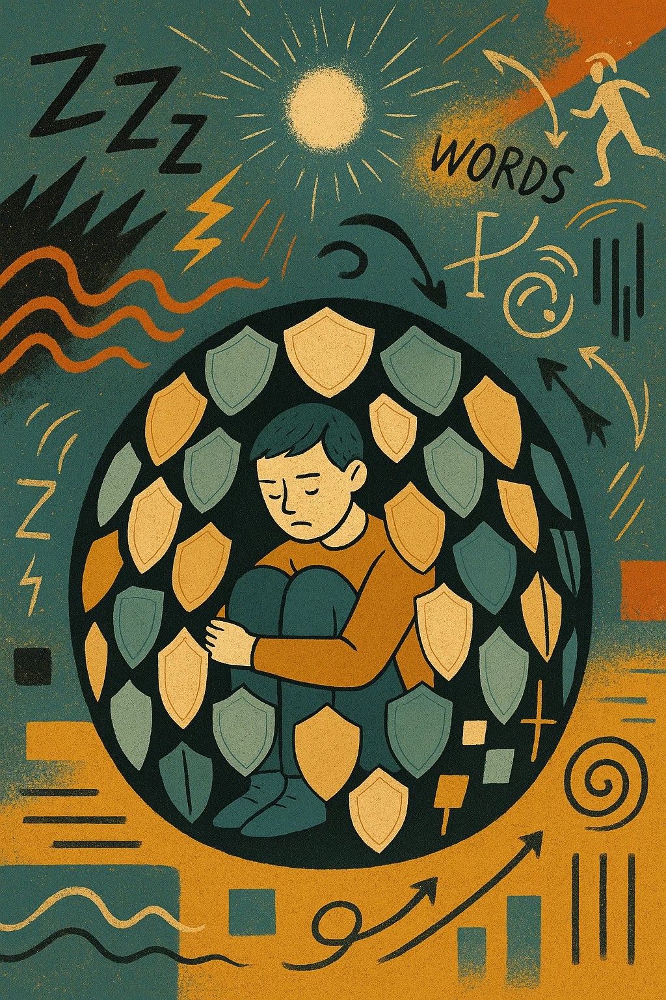

# Autism Sensory Model / Autismus-Sensorik-Modell

Ein multidimensionales Modell zur Erklärung autistischer Verhaltensmuster auf Basis sensorischer Verarbeitung.

A multidimensional model to explain autistic behavioral patterns based on sensory processing.

## Verfügbare Sprachen / Available languages

- [Deutsch / German](de/) - Vollständige Version
- [English / Englisch](en/) - complete version

## Kernthesen / Core Theses

- Autismus ist kein einheitliches Störungsbild, sondern ein Muster von **Anpassungsreaktionen auf eine abweichende sensorische Wahrnehmung**
- Viele autistische Verhaltensweisen sind **sekundäre Strategien** im Umgang mit Reizüberflutung oder -mangel
- Autismus entsteht nicht im Gehirn allein, sondern im **Zusammenspiel von sensorischer Innenwelt und Umweltanforderungen**
- Ein **multidimensionaler Ansatz** ermöglicht individuelle Unterstützung statt standardisierter Therapie

- Autism is not a uniform disorder, but a pattern of **adaptive responses to divergent sensory perception**
- Many autistic behaviors are **secondary strategies** for dealing with sensory overload or deficit
- Autism does not arise in the brain alone, but in the **interaction between internal sensory world and environmental demands**
- A **multidimensional approach** enables individualized support instead of standardized therapy

## Lesemöglichkeiten / Reading Options

Sie können diesen Text auf verschiedene Weise lesen:

- **[Vollständiges Dokument](de/)** - Das gesamte Paper auf einer Seite
- **[Kapitelweise Navigation](de/chapters/01-einleitung.md)** - Für fokussiertes Lesen
- **[Populärwissenschaftliche Version](de/popular-version.md)** - Leicht verständliche Kurzfassung
- **PDF-Version** - Verwenden Sie die "Drucken"-Funktion Ihres Browsers

You can read this text in different ways:

- **[Complete Document](en/)** - The entire paper on one page
- **[Chapter-by-Chapter Navigation](en/chapters/01-introduction.md)** - For focused reading
- **[Popular Science Version](en/popular-version.md)** - Easy-to-understand summary
- **PDF Version** - Use your browser's "Print" function

## Beitragen / Contribute

Dieses Projekt ist offen für Beiträge, Übersetzungen und Erweiterungen. Besuchen Sie unser [GitHub Repository](https://github.com/y4cine/autism-sensory-model) für weitere Informationen.

This project is open for contributions, translations, and extensions. Visit our [GitHub Repository](https://github.com/y4cine/autism-sensory-model) for more information.
